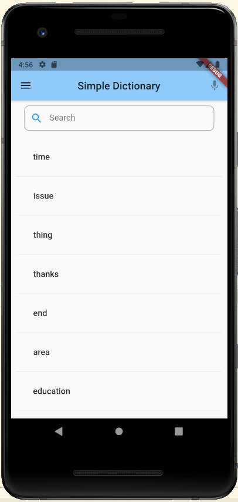
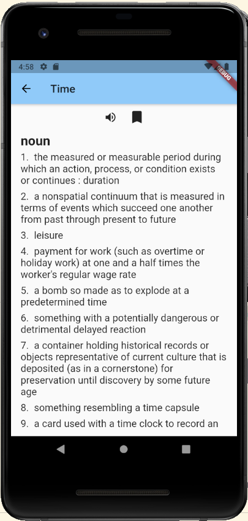

# Simple Dictionary

A Flutter dictionary app for quickly looking up English words, hearing their
pronunciation, and keeping track of useful vocabulary. Definitions are provided
by the Merriam-Webster Collegiate Dictionary API, while search history and saved
words are stored locally on the device.

## Features

- Look up definitions grouped by part of speech
- Get search suggestions as you type
- Hear words pronounced with text-to-speech
- Bookmark words for later
- Review up to 50 recently searched words
- See your most frequently searched words
- Sort saved words by newest or alphabetically
- Keep history and bookmarks in a local SQLite database

## Demo

https://user-images.githubusercontent.com/32963956/111727813-fdf6e500-8841-11eb-9f62-3d38500c08d7.mp4

| Search and history | Definitions |
| --- | --- |
|  |  |

## Getting started

### Prerequisites

- A Flutter release that includes Dart 2.x (the current project constraint is
  `>=2.7.0 <3.0.0`)
- A free [Merriam-Webster Dictionary API](https://dictionaryapi.com/) key
- An Android or iOS development environment configured for Flutter

### Installation

1. Clone the repository:

   ```bash
   git clone git@github.com:kevinc16/flutter_dictionary.git
   cd flutter_dictionary
   ```

2. Install the dependencies:

   ```bash
   flutter pub get
   ```

   If your Flutter installation includes Dart 3, use an older compatible
   Flutter release or migrate the SDK constraint and dependencies first.

3. Create `lib/key.dart` and add your Merriam-Webster API key:

   ```dart
   const String dictApiKey = 'YOUR_API_KEY';
   ```

   This file is ignored by Git so the key is not committed.

4. Start the app on a connected device or emulator:

   ```bash
   flutter run
   ```

## Built with

- [Flutter](https://flutter.dev/) and Dart
- [Merriam-Webster Dictionary API](https://dictionaryapi.com/)
- [SQLite](https://pub.dev/packages/sqflite) for on-device storage
- [flutter_tts](https://pub.dev/packages/flutter_tts) for pronunciation
- [flutter_typeahead](https://pub.dev/packages/flutter_typeahead) for search suggestions

## Project structure

```text
lib/
├── main.dart  # App screens, search, saved words, and history
├── api.dart   # Dictionary API client and definition rendering
├── db.dart    # Local SQLite persistence
├── tts.dart   # Text-to-speech controls
└── key.dart   # Local API key (not committed)
```

## License

This project is available under the [MIT License](LICENSE).
